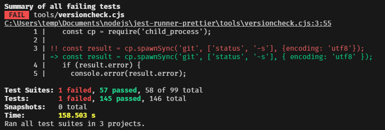

# @sugoroku-y/jest-runner-prettier

[](https://jestjs.io/) [](https://prettier.io/) [](https://www.typescriptlang.org/) [](https://developer.mozilla.org/en-US/docs/Web/JavaScript) [](https://github.com/sugoroku-y/jest-runner-prettier/pkgs/npm/jest-runner-prettier) [](./LICENSE) [](https://coveralls.io/github/sugoroku-y/jest-runner-prettier) [](./.github/workflows/publish.yml) [](./.github/workflows/coverage.yml)

an alternative `Prettier runner for Jest` besides [jest-runner-prettier](https://github.com/keplersj/jest-runner-prettier)

> [jest-runner-prettier](https://github.com/keplersj/jest-runner-prettier)以外の、もう1つのJest用Prettierランナー

## Difference from [jest-runner-prettier](https://github.com/keplersj/jest-runner-prettier)(違うところ)

The differences from [jest-runner-prettier](https://github.com/keplersj/jest-runner-prettier) are as follows:

> [jest-runner-prettier](https://github.com/keplersj/jest-runner-prettier)と違う点は以下のとおりです。

- The Issue [Prettier APIs went async as of Prettier 3.0.0](https://github.com/keplersj/jest-runner-prettier/issues/586) has been resolved.

  When used with Prettier 3.0.0 or later, [jest-runner-prettier](https://github.com/keplersj/jest-runner-prettier) did not report any format omissions.

  > [Prettier APIs went async as of Prettier 3.0.0](https://github.com/keplersj/jest-runner-prettier/issues/586)の問題を解消しています。
  >
  > Prettier 3.0.0以降と併用すると[jest-runner-prettier](https://github.com/keplersj/jest-runner-prettier)ではフォーマット漏れがあっても報告されませんでした。

- If you have a `.gitignore` or `.prettierignore`, the files described in it are excluded from the inspection.

  It is not necessary to specify files not subject to formatting in both `jest.config.js` and `.prettierignore`.

  > `.gitignore`や`.prettierignore`があれば、そこに書かれているファイルを検査対象から除外します。
  >
  > `jest.config.js`と`.prettierignore`の両方にフォーマット対象外のファイルを指定する必要はありません。

- If any files are not formatted by Prettier, the differences are displayed.

  > Prettierによってフォーマットされていないファイルがあれば、差分を表示します。

  

- Some items can be customized according to the settings described in `jest-runner-prettier.config.js`.

  > `jest-runner-prettier.config.js`に記述した設定内容によってカスタマイズできる項目があります。

## Usage(使い方)

### Install(インストール)

Install jest, prettier and `@sugoroku-y/jest-runner-prettier`.

> jest、prettierと`@sugoroku-y/jest-runner-prettier`をインストールします。

```command
npm i -D jest prettier sugoroku-y/jest-runner-prettier
```

### Add to Jest config(Jestの設定に追加)

#### Using Built-in Preset(ビルトインのプリセットを使用する)

This package includes a Jest preset which configures Jest to run Prettier on all files supported by Prettier. To use it set the following in your `package.json`:

> このパッケージには、PrettierがサポートするすべてのファイルでPrettierを実行するようにJestを設定するJestプリセットが含まれています。これを使用するには、`package.json` で以下を設定してください：

```json
{
  "jest": {
    "preset": "@sugoroku-y/jest-runner-prettier"
  }
}
```

or `jest.config.js`:

> もしくは`jest.config.js`で以下を設定してください:

```js
module.exports = {
  preset: '@sugoroku-y/jest-runner-prettier',
};
```

If you are already using Prettier and have already set up `.prettierrc` and `.prettierignore`, this is recommended. You only need to set `preset` and nothing else.

> すでにPrettierを使用していて`.prettierrc`や`.prettierignore`などの設定が済んでいる場合はこちらを推奨します。`preset`の設定だけでほかの指定は不要です。

#### Manually(手動設定)

In your `package.json`

> `package.json`に設定する場合。

```json
{
  "jest": {
    "runner": "@sugoroku-y/jest-runner-prettier",
    "moduleFileExtensions": ["js", "jsx", "ts", "tsx", "json"],
    "testMatch": ["**/*.js", "**/*.jsx", "**/*.ts", "**/*.tsx", "**/*.json"]
  }
}
```

Or in `jest.config.js`

> `jest.config.js`の場合。

```js
module.exports = {
  runner: '@sugoroku-y/jest-runner-prettier',
  moduleFileExtensions: ['js', 'jsx', 'ts', 'tsx', 'json'],
  testMatch: ['**/*.js', '**/*.jsx', '**/*.ts', '**/*.tsx', '**/*.json'],
};
```

It should be sufficient to specify settings such as `moduleFileExtensions` and `testMatch` with `preset`, but if for some reason that is not sufficient, specify them here.

> `moduleFileExtensions`や`testMatch`などの設定は`preset`で指定していれば十分であるはずですが、何らかの事情によりそれでは足りない場合にこちらで指定します。

### Run Jest(Jestの実行)

```cmd
npx jest
```

Then prepare `.prettierrc`, `.prettierignore`, etc. as required.

> あとは必要に応じて`.prettierrc`や`.prettierignore`などを用意してください。

## Customizable Features(カスタマイズ項目)

You can customize the behavior and display of Prettier by placing the following file named `jest-runner-prettier.config.js` in the root of your project.

> プロジェクトのルートに`jest-runner-prettier.config.js`というファイル名で以下の内容を置いておくことで、実行するPrettierの挙動や表示内容をカスタマイズできます。

```js
export default {
  config: '.example',
  ignorePath: '.prettier-ignore',
  diff: {
    expand: true,
    contextLines: 4,
    thresholdForOmitting: 50,
  },
};
```

The contents of each configuration item are as follows:

> 各設定項目の内容は以下のとおりです。

- `config`

  Specifies the file name of the `.prettierrc` configuration file.

  Specify a string or `null`.

  If set `null`, Prettier configuration file will not be searched.

  If omitted, the default Prettier configuration file, such as `.prettierrc`, is retrieved and used.

  > Prettierの設定ファイル`.prettierrc`のファイル名を指定します。
  >
  > 文字列もしくは`null`を指定します。
  >
  > `null`に設定すると、Prettierの設定ファイルを検索しません。
  >
  > 省略した場合は、`.prettierrc`のようなデフォルトのPrettier設定ファイルを検索して使用します。

- `useCache`

  If set to false, all caching will be bypassed.

  Specify `true` or `false`.

  If omitted, `false` (do not use cache) is assumed to be specified.

  > `false`に設定すると、すべてのキャッシュがバイパスされます。
  >
  > `true`または`false`を指定します。
  >
  > 省略した場合は`false`(キャッシュを使用しない)が指定されたものと見なします。

- `editorconfig`

  If set to `true` and an `.editorconfig` file is in your project,
  Prettier will parse it and convert its properties to the corresponding prettier configuration.

  Specify `true` or `false`.

  If omitted, `true` (convert `.editorconfig` if it exists) is assumed to be specified.

  > もし`true`に設定されていて、`.editorconfig`ファイルがプロジェクトにあれば、
  > Prettier はそれを解析し、そのプロパティを対応する prettier の設定に変換します。
  >
  > `true`または`false`を指定します。
  >
  > 省略した場合は`true`(`.editorconfig`があれば変換する)が指定されたものと見なします。

- `ignorePath`

  The name of a file that specifies a file that is not covered by Prettier.

  Specify a string or an array of strings.

  If omitted, `['.gitignore', '.prettierignore']` is assumed to be specified.

  > Prettierの対象外ファイルを指定するファイル名です。
  >
  > 文字列、もしくは文字列の配列を指定します。
  >
  > 省略した場合は`['.gitignore', '.prettierignore']`が指定されたものと見なします。

- `withNodeModules`

  If set `true`, Prettier will not ignore files located in `node_modules` directory.

  Specify `true` or `false`.

  If omitted, `false`(ignore files located in `node_modules` directory) is assumed to be specified.

  > もし`true`に設定されていれば、Prettierは`node_modules`ディレクトリにあるファイルを無視しません。
  >
  > `true`または`false`を指定します。
  >
  > 省略した場合は`false`(`node_modules`ディレクトリにあるファイルを無視する)が指定されたものと見なします。

- `diff.expand`

  Specifies whether or not to expand lines with no differences when displaying the contents of unformatted files.

  Specify `true` or `false`.

  If omitted, `false` (do not expand non-diff lines) is assumed to be specified.

  > フォーマットされていないファイルの内容を表示する際に、差分のない行も展開して表示するかどうかを指定します。
  >
  > `true`または`false`を指定します。
  >
  > 省略した場合は`false`(差分のない行を省略する)が指定されたものと見なします。

- `diff.contextLines`

  Specifies how many lines before and after the diff line to display when the contents of an unformatted file are not expanded.

  Specified as an integer number.

  If omitted, `2` is assumed to be specified.

  > フォーマットされていないファイルの内容を展開しないで表示する際に、差分のある行の前後を何行表示するかを指定します。
  >
  > 整数値で指定します。
  >
  > 省略した場合は`2`が指定されたものと見なします。

- `diff.thresholdForOmitting`

  Specifies the number of lines to omit when displaying the contents of an unformatted file if there are too many lines to display.

  Specified as an integer number.

  If omitted, `20` is assumed to be specified.

  > フォーマットされていないファイルの内容を表示する際に、表示する行数が多すぎた場合に省略する行数を指定します。
  >
  > 整数値で指定します。
  >
  > 省略した場合は`20`が指定されたものと見なします。

If the file does not exist, all of the above are assumed to be omitted.

> ファイルが存在していない場合は上記すべてが省略されたものと見なします。

The configuration file is loaded using [cosmiconfig](https://github.com/cosmiconfig/cosmiconfig), so it can be read not only from `jest-runner-prettier.config.js`, but also from the `package.json` property, or by reading from rc files, rc files with `.json` or other extensions.

> 設定ファイルの読み込みには[cosmiconfig](https://github.com/cosmiconfig/cosmiconfig)を利用しているので`jest-runner-prettier.config.js`からの読み込むだけでなく、`package.json`のプロパティで指定したり、rcファイル、rcファイルに`.json`などの拡張子を付けたファイルから読み込む、など各種の設定方法が利用できます。

## License(使用許諾)

Copyright YEBISUYA Sugoroku 2024. Licensed MIT.
